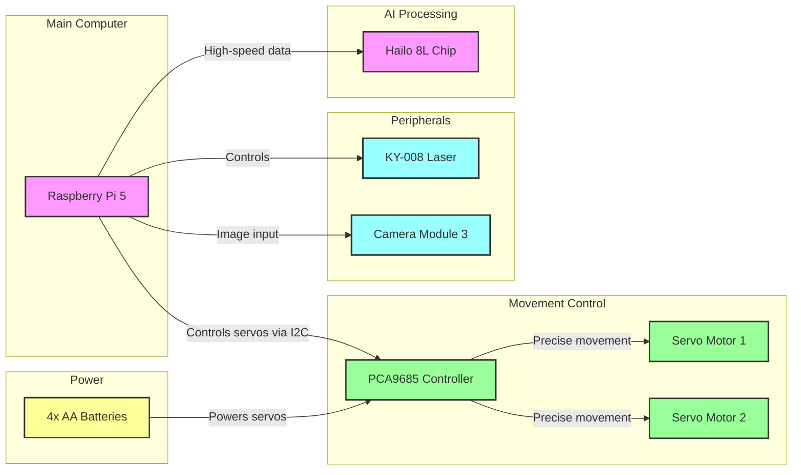
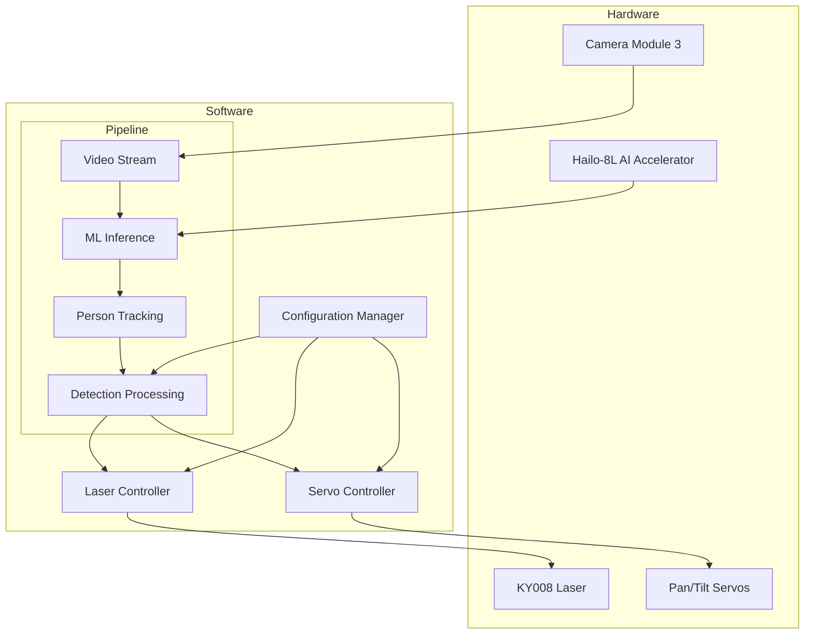
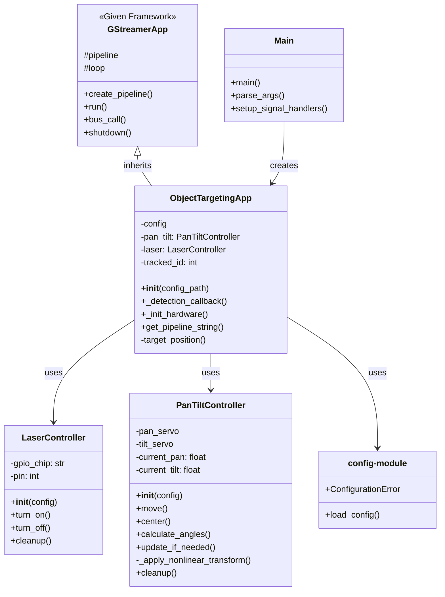
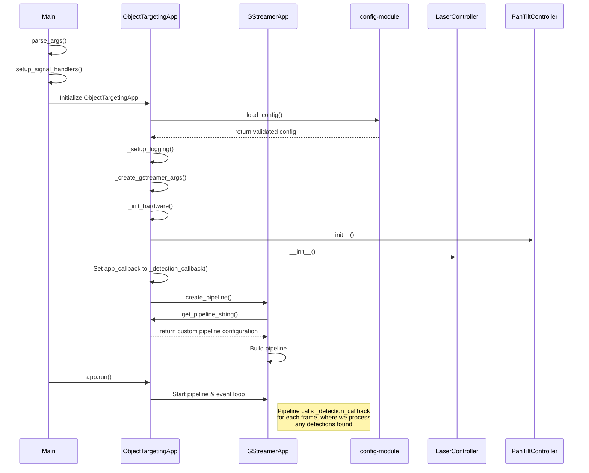

# Object Targeting System with AI-Powered Tracking

## Table of Contents
1. [Introduction](#1-introduction)
   - [Purpose](#purpose)
   - [System Demo](#system-demo)
   - [Key Features](#key-features)

2. [Hardware](#2-hardware)
   - [Key Technical Concepts](#key-technical-concepts)
   - [Components Overview](#components-overview)
   - [Connection Diagrams](#connection-diagrams)
   - [Detailed Connections](#detailed-connections)

3. [Software Overview](#3-software-overview)
   - [System Architecture](#system-architecture)
   - [Core Components](#core-components)
   - [Basic Operation Flow](#basic-operation-flow)

4. [Software Architecture and Components](#4-software-architecture-and-components)
   - [Class Diagram](#class-diagram)
   - [Core Framework](#core-framework)
   - [Main Application](#main-application)
   - [Hardware Control](#hardware-control)
   - [Configuration](#configuration)
   - [Directory Structure](#directory-structure)

5. [Application Startup Flow](#5-application-startup-flow)
   - [Overview](#overview)
   - [Startup Sequence Diagram](#startup-sequence-diagram)
   - [Startup Sequence Details](#startup-sequence-details)
   - [Error Handling](#error-handling)
   - [Shutdown Process](#shutdown-process)

---

# 1. Introduction

## Purpose
This is a person-tracking system that uses AI to detect people in a video feed and automatically aims a laser at them by controlling a pan/tilt servo mechanism. The system leverages the Hailo-8L AI accelerator for efficient ML processing and provides precise targeting through servo-controlled movement.

## System Demo
[Video Placeholder: demonstration video showing the system in action]

## Key Features
- Real-time person detection using YOLOv8 model
- Hardware-accelerated ML inference with Hailo-8L
- Continuous person tracking with unique IDs
- Precise pan/tilt targeting system
- Automatic laser aiming
- Configurable settings for different environments

---

# 2. Hardware

## Key Technical Concepts

### I2C (Inter-Integrated Circuit)
A communication protocol that allows multiple devices to communicate with the Raspberry Pi using just two wires (SDA for data transmission and SCL for synchronization timing), enabling efficient connection of several components through shared connection wires.

### PWM (Pulse Width Modulation)
A technique for controlling power or signals by rapidly switching them on and off. The ratio between "on" time and "off" time determines the exact position for servos or brightness level for the laser.

## Components Overview

how can i do it?
| Component Name | Function | Image |
|----------------|-----------|--------|
| Raspberry Pi 5 | A single-board computer that can run a full operating system. Features GPIO pins for hardware interfacing, supporting various communication protocols like I2C, SPI, and UART. |  |
| Raspberry Pi Camera Module 3 | A high-resolution camera module specifically designed for Raspberry Pi. Connects via CSI (Camera Serial Interface) and supports various video formats and resolutions. |  |
| KY-008 Laser Module | A semiconductor laser diode module that can emit a focused beam of light. Can be controlled through digital signals for on/off functionality or PWM for variable intensity. |  |
| MG996R Servo Motor (x2) | Digital servo motors used for precise positioning and movement control. |  |
| PCA9685 | A 16-channel PWM/Servo driver that communicates via I2C. Used to control multiple servos or other PWM devices while only using two pins on the main controller. |  |
| Hailo 8L AI Chip | An edge AI processor designed for deep learning applications. Accelerates neural network operations and can be integrated with main processors through PCIe interface. |  |
| 4x AA Battery Pack | A power supply unit that holds 4 AA batteries in series, providing portable DC power. Used to power motors and other high-current devices. |  |


## Connection Diagrams

### Logical Connection Diagram


### Physical Layout


## Detailed Connections

### Raspberry Pi 5 → PCA9685 Connection

| Raspberry Pi 5 | PCA9685 |
|---------------|---------|
| Port 1 (3.3V) | VCC |
| Port 3 (GPIO2 SDA) | SDA |
| Port 5 (GPIO3 SCL) | SCL |
| Port 9 (Ground) | Ground |

#### Connection Functions:
* **VCC (3.3V)**: Provides power to the controller's logic circuits
* **SDA (Serial Data)**: Enables data transmission through I2C protocol
* **SCL (Serial Clock)**: Provides timing synchronization for I2C communication
* **Ground**: Establishes common reference point for electrical circuit

### PCA9685 → MG996R Servo Motor 1

| PCA9685 | MG996R Servo 1 |
|---------|----------------|
| PWM Channel 1 | PWM |
| V+ Channel 1 | 5V |
| GND Channel 1 | GND |

#### Connection Functions:
* **PWM**: Carries the pulse-width modulation signal for precise position control
* **5V**: Provides operational power to the servo motor
* **GND**: Completes the circuit and provides reference ground

### PCA9685 → MG996R Servo Motor 2

| PCA9685 | MG996R Servo 2 |
|---------|----------------|
| PWM Channel 2 | PWM |
| V+ Channel 2 | 5V |
| GND Channel 2 | GND |

#### Connection Functions:
Same as Servo Motor 1

### Raspberry Pi 5 → KY-008 Laser Module

| Raspberry Pi 5 | KY-008 |
|---------------|---------|
| Port 33 (GPIO 13 PWM1) | Signal |
| Port 25 (Ground) | Ground |

#### Connection Functions:
* **Signal**: Controls laser activation and intensity through PWM
* **Ground**: Completes the circuit and provides reference ground

### Battery Pack → PCA9685

| Battery Pack | PCA9685 |
|-------------|----------|
| V+ (6V Positive) | V+ |
| GND (Ground) | GND |

#### Connection Functions:
* **V+**: Provides 6V power supply for driving the servo motors
* **GND**: Provides ground reference and completes the power circuit for servo operation

### Raspberry Pi 5 → Hailo 8L AI Chip

| Raspberry Pi 5 | Hailo 8L |
|---------------|-----------|
| PCIe | PCIe |

#### Connection Functions:
* **PCIe**: Provides high-speed data transfer between the Raspberry Pi and AI accelerator

### Raspberry Pi 5 → Camera Module 3

# 3. Software Overview

## System Architecture


## Core Components

### Software Layer
#### Custom Pipeline (GStreamer Framework based):
- Video stream handling from camera
- ML inference using Hailo-8L
- Person tracking with unique IDs
- Detection processing for targeting

#### Controllers:
- **Configuration Management**:
  - Centralizes all system settings
  - Manages hardware configurations
  - Handles resource paths
- **Hardware Control**:
  - Pan/Tilt servo control for precise aiming
  - Laser control for target indication

## Basic Operation Flow
1. Camera feeds video into our pipeline
2. Hailo-8L runs the YOLOv8 model for person detection
3. System assigns unique IDs to detected people and tracks them continuously
4. Among tracked people, system targets the one with lowest tracking ID (first person detected)
5. Servo controller calculates angles based on target's position
6. Laser is activated and aimed at the tracked target

---

# 4. Software Architecture and Components
## Class Diagram
**Note**: The diagram illustrates the core architecture of our system, showing:
- Inheritance (ObjectTargetingApp inherits from the given GStreamerApp framework)
- Dependencies between components 
- Key methods and fields for each class/module
- Access modifiers (`-` private, `+` public, `#` protected)


## Core Framework
### `GStreamerApp` (`g_streamer_app.py`)
- A framework class provided by Hailo for GStreamer-based applications
- Defines base functionality for:
  - GStreamer pipeline management
  - Basic video processing functionality
  - Event loop handling
  - Resource management
- Provides utility functions for pipeline creation
- **Note**: This is not our original code but a framework we build upon

## Main Application
### `Main` (`main.py`)
- Entry point script that:
  - Handles command-line argument parsing
  - Sets up signal handlers for graceful shutdown
  - Creates and runs the main application instance

### `ObjectTargetingApp` (`object_targeting_app.py`)
- Core application class inheriting from `GStreamerApp`
- Manages the GStreamer pipeline configuration
- Processes video frames through the Hailo-8L accelerator
- Implements person detection and tracking logic
- Coordinates hardware control based on detection results

## Hardware Control
### `PanTiltController` (`pan_tilt_controller.py`)
- Manages the pan/tilt servo mechanism
- Implements servo calibration and safety limits
- Handles angle calculations and movement control
- Provides precise positioning for person tracking

### `LaserController` (`laser_controller.py`)
- Controls the laser module through GPIO
- Handles safe initialization and cleanup
- Provides simple on/off functionality
- Manages laser state based on detection results

## Configuration

### Configuration File (`config.yaml`)
- User-editable configuration file containing all system settings:
  - Hardware parameters (servo angles, GPIO pins)
  - Detection thresholds for ML model
  - Path configurations
  - Field of view settings
  - Log file locations

### Configuration Module (`config.py`)
- Implements configuration loading and validation
- Ensures safe access to configuration settings
- Validates all required files and paths exist
- Converts relative paths to absolute
- Raises clear errors if configuration is invalid

## Directory Structure
```
src/
├── __init__.py              # Package initialization
├── main.py                  # Entry point
├── object_targeting_app.py  # Core application logic
├── g_streamer_app.py        # Hailo framework (from Hailo)
├── pan_tilt_controller.py   # Servo management
├── laser_controller.py      # Laser control
└── config.py                # Configuration handling
```

---

# 5. Application Startup Flow

## Overview
The application follows a structured startup sequence that ensures proper initialization of all components. The process begins with `main.py`, which serves as the entry point, and progresses through configuration loading, hardware initialization, and pipeline setup.

## Startup Sequence Diagram


## Startup Sequence Details

### 1. Entry Point (`main.py`)
The application begins in `main.py`, which:
- **Parses Arguments**: Uses argparse to handle command-line arguments
  - Primary argument is `--config` for specifying configuration file path
  - Default config path is 'config.yaml'
- **Sets Up Signal Handlers**: Establishes cleanup handlers for system signals
  - SIGINT (Ctrl+C) and SIGTERM trigger graceful shutdown
  - Ensures hardware cleanup (laser off, servos centered) on termination
- **Initializes Application**: Creates and initializes ObjectTargetingApp instance

### 2. ObjectTargetingApp Initialization
The ObjectTargetingApp performs several initialization steps:

#### Configuration Loading
- Calls `load_config()` from config module to:
  - Load and parse config.yaml
  - Validate all required fields exist
  - Convert relative paths to absolute
  - Verify existence of model files (HEF and post-process)
  
#### Setup and Arguments
- **Logging Setup**: Creates log directory and configures logging
- **GStreamer Arguments**: Creates argument namespace for GStreamer initialization
  - Sets video input to "rpi" for Raspberry Pi camera
  - Configures Hailo-8L specific settings (`arch="hailo8l"`)
  - Specifies ML model:
    - YOLOv8 model compiled to HEF (Hailo Executable Format)
    - Optimized for Hailo-8L accelerator

#### Hardware Initialization
- **Pan/Tilt Controller**: 
  - Initializes with servo configuration
  - Sets up I2C communication (a serial protocol used by Raspberry Pi to communicate with the servo controller board (PCA 9685))
  - Moves to center position
  - Note: I2C allows multiple hardware components to communicate using just two pins: SDA (data) and SCL (clock)

- **Laser Controller**:
  - Sets up GPIO control (General Purpose Input/Output - Raspberry Pi's pins that can be programmed to control hardware)
  - Ensures laser starts in OFF state (GPIO pin set to LOW/0V)
  - Note: GPIO pins can be set to HIGH (3.3V) or LOW (0V) to control simple devices like our laser

### 3. Pipeline Setup
The application leverages GStreamer's framework while implementing custom behavior:

#### Custom Pipeline Configuration
- ObjectTargetingApp overrides `get_pipeline_string()` to define our custom pipeline
- Base GStreamerApp calls our implementation to get pipeline configuration
- Pipeline is built with components for:
  - Video capture (SOURCE_PIPELINE from RPI camera)
  - ML inference (INFERENCE_PIPELINE with YOLOv8s)
  - Person tracking (TRACKER_PIPELINE with tracking frames configuration)
  - Detection processing (USER_CALLBACK_PIPELINE for frame processing)
  - Display output (DISPLAY_PIPELINE with FPS counter)
  
#### Detection Callback Setup
- Sets `_detection_callback` as the frame processor
- This callback is called for every frame and:
  - Processes ML inference results
  - Updates tracking information
  - Controls hardware based on detections

### 4. Application Runtime
Once initialization is complete:
- GStreamer pipeline starts processing frames
- Each frame triggers the detection callback
- Hardware controllers respond to detection results
- Main event loop maintains continuous operation

## Error Handling
The application implements comprehensive error handling:
- Configuration errors raise ConfigurationError with clear messages
- Hardware initialization failures trigger cleanup of already initialized components
- Pipeline creation failures are caught and logged
- All errors are logged with full context for debugging

## Shutdown Process
When shutdown is triggered (via signal or error):
1. Pipeline is stopped and cleaned up
2. Hardware is reset:
   - Laser turned off
   - Servos centered
   - GPIO resources released
3. Logging is finalized
4. Process exits cleanly