# Object Targeting System with AI-Powered Tracking

## Table of Contents
1. [Introduction](#1-introduction)
   - [Purpose](#purpose)
   - [System Overview Video](#system-overview-video)
   - [System Demo Video](#system-demo-video)
   - [Key Features](#key-features)

2. [Hardware](#2-hardware)
   - [Key Technical Concepts](#key-technical-concepts)
   - [Components Overview](#components-overview)
   - [Connection Diagrams](#connection-diagrams)
   - [Detailed Connections](#detailed-connections)

3. [Software Overview](#3-software-overview)
   - [System Architecture](#system-architecture)
   - [Core Components](#core-components)
   - [Basic Operation Flow](#basic-operation-flow)

4. [Software Architecture and Components](#4-software-architecture-and-components)
   - [Class Diagram](#class-diagram)
   - [Core Framework](#core-framework)
   - [Main Application](#main-application)
   - [Hardware Control](#hardware-control)
   - [Configuration](#configuration)
   - [Directory Structure](#directory-structure)

5. [Application Startup Flow](#5-application-startup-flow)
   - [Overview](#overview)
   - [Startup Sequence Diagram](#startup-sequence-diagram)
   - [Startup Sequence Details](#startup-sequence-details)
   - [Error Handling](#error-handling)
   - [Shutdown Process](#shutdown-process)

6. [Video Processing Pipeline](#6-video-processing-pipeline)
   - [Overview](#overview-1)
   - [Our Custom Pipeline Structure](#our-custom-pipeline-structure)
     - [Pipeline Elements Flow](#pipeline-elements-flow)
     - [Source Pipeline](#1-source_pipeline)
     - [Inference Pipeline](#2-inference_pipeline)
     - [Tracker Pipeline](#3-tracker_pipeline)
     - [User Callback Pipeline](#4-user_callback_pipeline)
     - [Display Pipeline](#5-display_pipeline)
   - [Custom Pipeline Implementation](#custom-pipeline-implementation)

7. [Frame Processing and Detection](#7-frame-processing-and-detection)
    - [Overview](#overview-2)
    - [Callback Processing Flow](#callback-processing-flow)
    - [Implementation Details](#implementation-details)
    - [Key Components](#key-components)
    - [Error Handling](#error-handling-1)

8. [Targeting System and Motion Control](#8-targeting-system-and-motion-control)
    - [Overview](#overview-3)
    - [Coordinate Processing Pipeline](#coordinate-processing-pipeline)
    - [Transformation Chain](#transformation-chain)
        - [Coordinate Normalization](#coordinate-normalization)
        - [Non-linear Transform](#non-linear-transform)
        - [Field of View Mapping](#field-of-view-mapping)
        - [Scaling Factor](#scaling-factor)
        - [Hardware Adaptation](#hardware-adaptation)

---

# 1. Introduction

## Purpose  
This system is designed to **prevent birds from eating food intended for cows** by using AI to detect birds and automatically aim a laser at them, deterring them without harm.  

It is a **bird-tracking system** that processes a **video feed in real time**, detects birds using AI, and **automatically directs a laser** at them via a **pan/tilt servo mechanism**. The system leverages the **Hailo-8L AI accelerator** for efficient machine learning processing and ensures **precise targeting through servo-controlled movement**. The **YOLOv8s model** is used for real-time object detection, providing fast and accurate identification of birds in the video feed.  

For **testing purposes**, the system currently **tracks people instead of birds**. Since testing on birds in a controlled environment is difficult—requiring an outdoor setup and waiting for birds to enter the frame—we have adapted the system to track people instead. This allows for a **more controlled and reliable evaluation**. However, the system can be easily reconfigured to track birds in its intended deployment.

## System Overview Video
https://github.com/user-attachments/assets/8b0ea3dc-ae83-4507-ad42-1374c002b7a2

## System Demo Video
https://github.com/user-attachments/assets/80e773d1-d014-44c5-bc59-44efadda6c1e

## Key Features
- Real-time person detection using YOLOv8 model
- Hardware-accelerated ML inference with Hailo-8L
- Continuous person tracking with unique IDs
- Precise pan/tilt targeting system
- Automatic laser aiming
- Configurable settings for different environments

---

# 2. Hardware

## Key Technical Concepts

### I2C (Inter-Integrated Circuit)
A communication protocol that allows multiple devices to communicate with the Raspberry Pi using just two wires (SDA for data transmission and SCL for synchronization timing), enabling efficient connection of several components through shared connection wires.

### PWM (Pulse Width Modulation)
A technique for controlling power or signals by rapidly switching them on and off. The ratio between "on" time and "off" time determines the exact position for servos or brightness level for the laser.

## Components Overview

| Component Name | Function | Image |
|----------------|-----------|--------|
| Raspberry Pi 5 | A single-board computer that can run a full operating system. Features GPIO pins for hardware interfacing, supporting various communication protocols like I2C, SPI, and UART. | 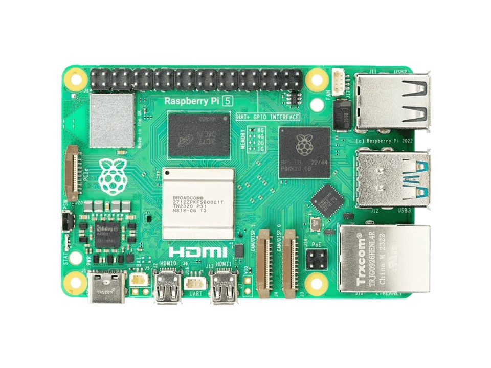 |
| Raspberry Pi Camera Module 3 | A high-resolution camera module specifically designed for Raspberry Pi. Connects via CSI (Camera Serial Interface) and supports various video formats and resolutions. | 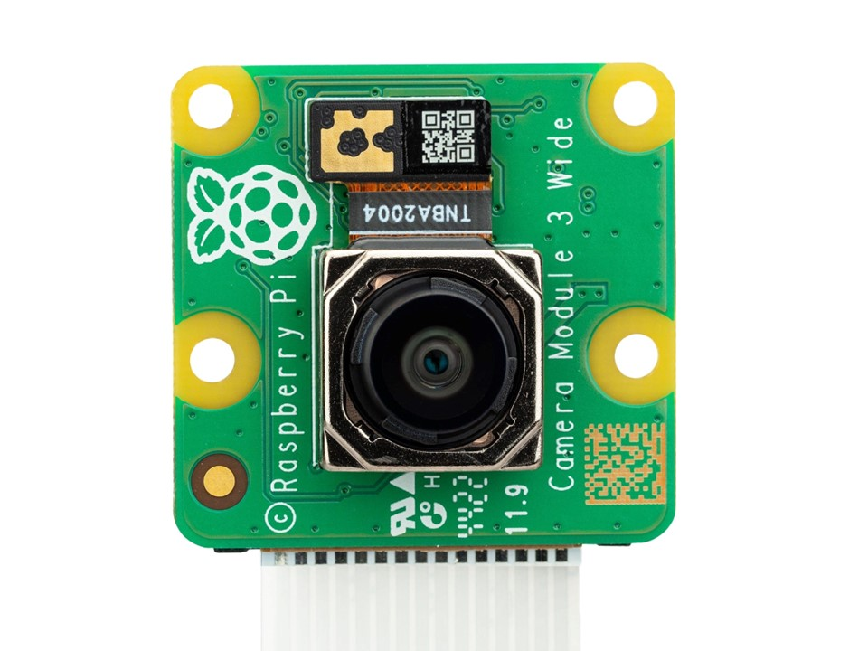 |
| KY-008 Laser Module | A semiconductor laser diode module that can emit a focused beam of light. Can be controlled through digital signals for on/off functionality or PWM for variable intensity. | 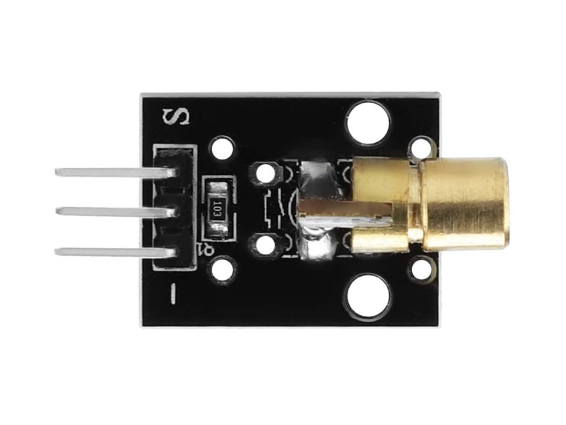 |
| MG996R Servo Motor (x2) | Digital servo motors used for precise positioning and movement control. | 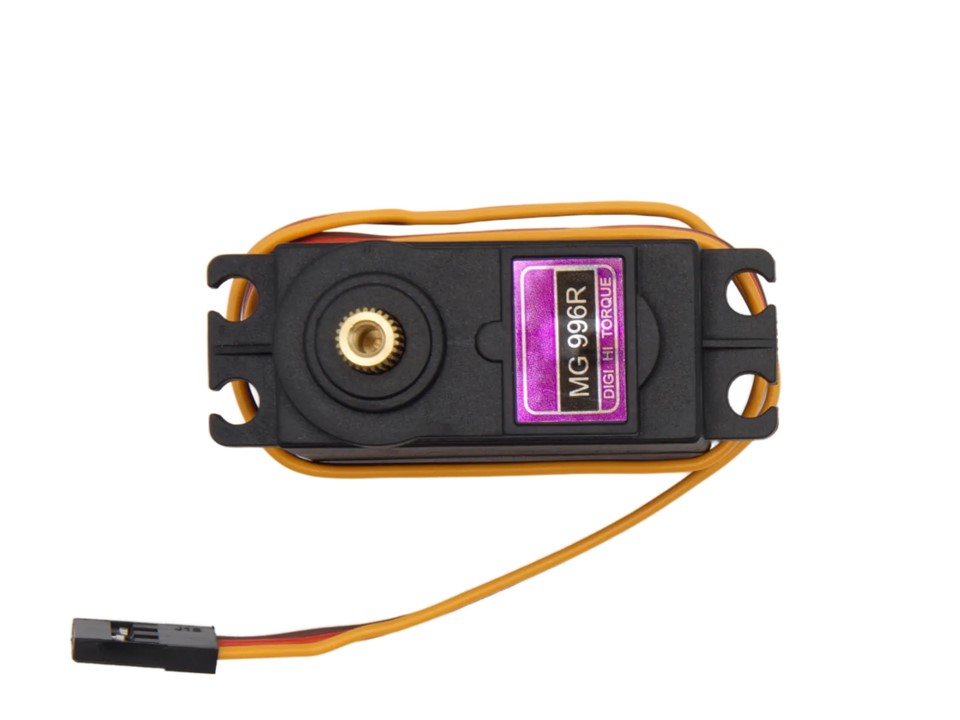 |
| PCA9685 | A 16-channel PWM/Servo driver that communicates via I2C. Used to control multiple servos or other PWM devices while only using two pins on the main controller. | 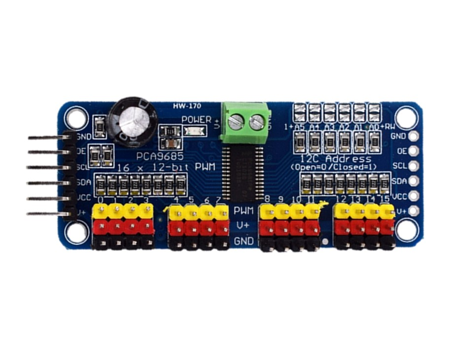 |
| Hailo 8L AI Chip | An edge AI processor designed for deep learning applications. Accelerates neural network operations and can be integrated with main processors through PCIe interface. | 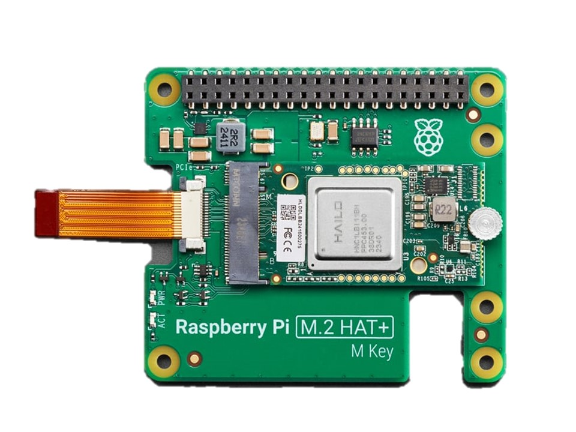 |
| 4x AA Battery Pack | A power supply unit that holds 4 AA batteries in series, providing portable DC power. Used to power motors and other high-current devices. | 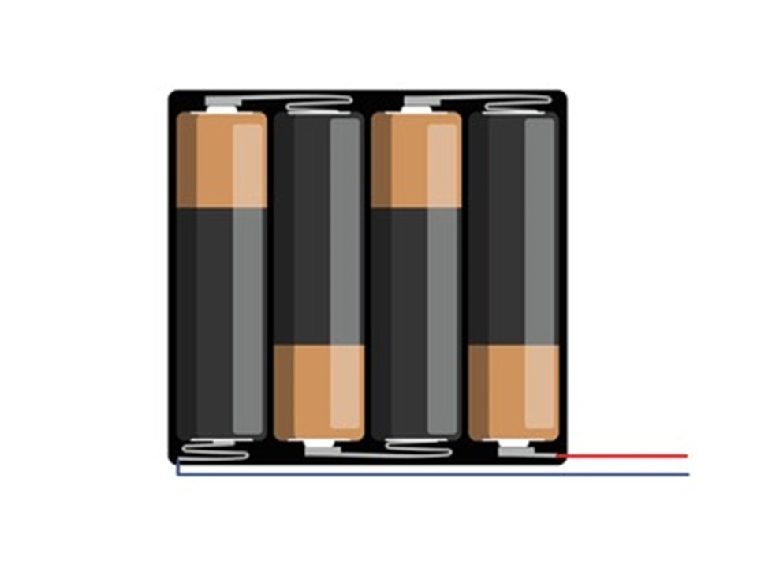 |


## Connection Diagrams

### Logical Connection Diagram

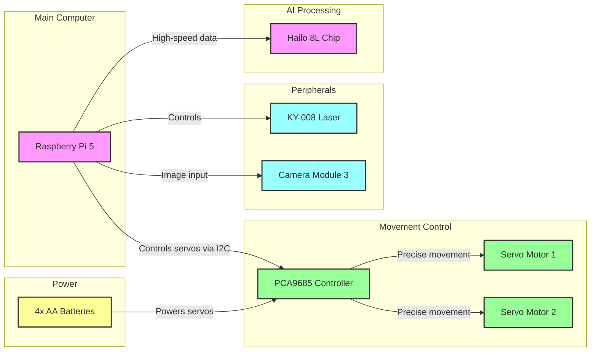

### Physical Layout
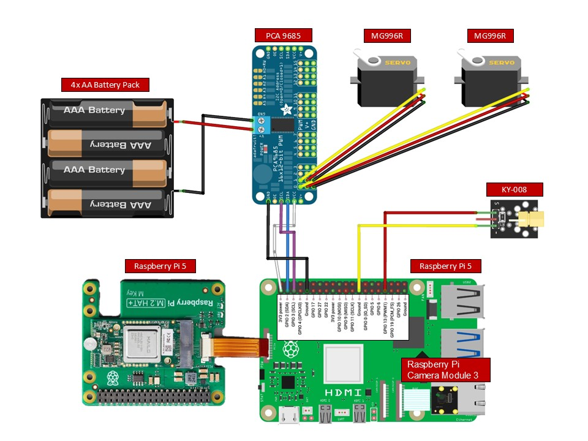

## Detailed Connections

### Raspberry Pi 5 → PCA9685 Connection

| Raspberry Pi 5 | PCA9685 |
|---------------|---------|
| Port 1 (3.3V) | VCC |
| Port 3 (GPIO2 SDA) | SDA |
| Port 5 (GPIO3 SCL) | SCL |
| Port 9 (Ground) | Ground |

#### Connection Functions:
* **VCC (3.3V)**: Provides power to the controller's logic circuits
* **SDA (Serial Data)**: Enables data transmission through I2C protocol
* **SCL (Serial Clock)**: Provides timing synchronization for I2C communication
* **Ground**: Establishes common reference point for electrical circuit

### PCA9685 → MG996R Servo Motor 1

| PCA9685 | MG996R Servo 1 |
|---------|----------------|
| PWM Channel 1 | PWM |
| V+ Channel 1 | 5V |
| GND Channel 1 | GND |

#### Connection Functions:
* **PWM**: Carries the pulse-width modulation signal for precise position control
* **5V**: Provides operational power to the servo motor
* **GND**: Completes the circuit and provides reference ground

### PCA9685 → MG996R Servo Motor 2

| PCA9685 | MG996R Servo 2 |
|---------|----------------|
| PWM Channel 2 | PWM |
| V+ Channel 2 | 5V |
| GND Channel 2 | GND |

#### Connection Functions:
Same as Servo Motor 1

### Raspberry Pi 5 → KY-008 Laser Module

| Raspberry Pi 5 | KY-008 |
|---------------|---------|
| Port 33 (GPIO 13 PWM1) | Signal |
| Port 25 (Ground) | Ground |

#### Connection Functions:
* **Signal**: Controls laser activation and intensity through PWM
* **Ground**: Completes the circuit and provides reference ground

### Battery Pack → PCA9685

| Battery Pack | PCA9685 |
|-------------|----------|
| V+ (6V Positive) | V+ |
| GND (Ground) | GND |

#### Connection Functions:
* **V+**: Provides 6V power supply for driving the servo motors
* **GND**: Provides ground reference and completes the power circuit for servo operation

### Raspberry Pi 5 → Hailo 8L AI Chip

| Raspberry Pi 5 | Hailo 8L |
|---------------|-----------|
| PCIe | PCIe |

#### Connection Functions:
* **PCIe**: Provides high-speed data transfer between the Raspberry Pi and AI accelerator

### Raspberry Pi 5 → Camera Module 3

| Raspberry Pi 5 | Camera Module 3 |
|---------------|----------------|
| CAM1 (CSI connector) | CSI ribbon cable port |


# 3. Software Overview

## System Architecture

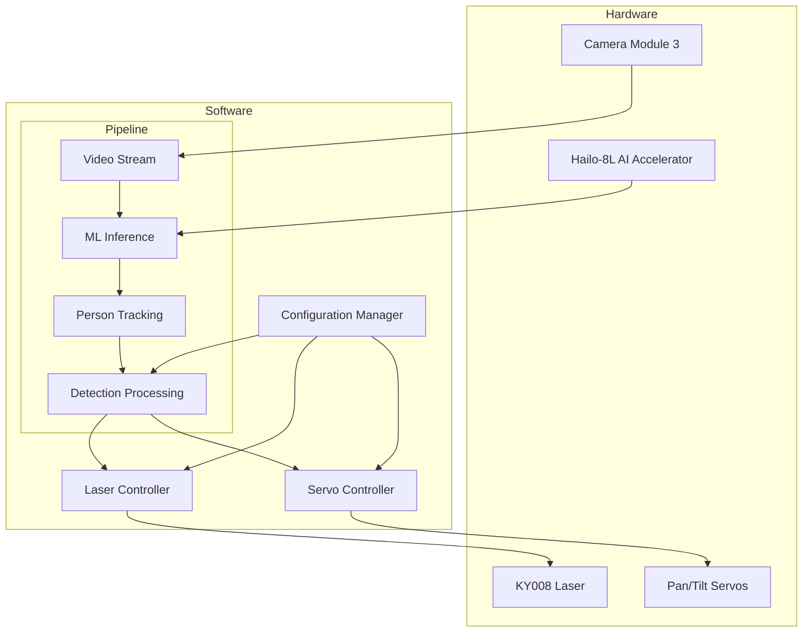

## Core Components

### Software Layer
#### Custom Pipeline (GStreamer Framework based):
- Video stream handling from camera
- ML inference using Hailo-8L
- Person tracking with unique IDs
- Detection processing for targeting

#### Controllers:
- **Configuration Management**:
  - Centralizes all system settings
  - Manages hardware configurations
  - Handles resource paths
- **Hardware Control**:
  - Pan/Tilt servo control for precise aiming
  - Laser control for target indication

## Basic Operation Flow
1. Camera feeds video into our pipeline
2. Hailo-8L runs the YOLOv8 model for person detection
3. System assigns unique IDs to detected people and tracks them continuously
4. Among tracked people, system targets the one with lowest tracking ID (first person detected)
5. Servo controller calculates angles based on target's position
6. Laser is activated and aimed at the tracked target

---

# 4. Software Architecture and Components
## Class Diagram
**Note**: The diagram illustrates the core architecture of our system, showing:
- Inheritance (ObjectTargetingApp inherits from the given GStreamerApp framework)
- Dependencies between components 
- Key methods and fields for each class/module
- Access modifiers (`-` private, `+` public, `#` protected)

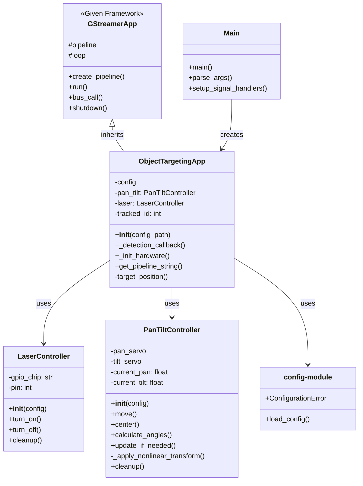

## Core Framework
### `GStreamerApp` (`g_streamer_app.py`)
- A framework class provided by Hailo for GStreamer-based applications
- Defines base functionality for:
  - GStreamer pipeline management
  - Basic video processing functionality
  - Event loop handling
  - Resource management
- Provides utility functions for pipeline creation
- **Note**: This is not our original code but a framework we build upon

## Main Application
### `Main` (`main.py`)
- Entry point script that:
  - Handles command-line argument parsing
  - Sets up signal handlers for graceful shutdown
  - Creates and runs the main application instance

### `ObjectTargetingApp` (`object_targeting_app.py`)
- Core application class inheriting from `GStreamerApp`
- Manages the GStreamer pipeline configuration
- Processes video frames through the Hailo-8L accelerator
- Implements person detection and tracking logic
- Coordinates hardware control based on detection results

## Hardware Control
### `PanTiltController` (`pan_tilt_controller.py`)
- Manages the pan/tilt servo mechanism
- Implements servo calibration and safety limits
- Handles angle calculations and movement control
- Provides precise positioning for person tracking

### `LaserController` (`laser_controller.py`)
- Controls the laser module through GPIO
- Handles safe initialization and cleanup
- Provides simple on/off functionality
- Manages laser state based on detection results

## Configuration

### Configuration File (`config.yaml`)
- User-editable configuration file containing all system settings:
  - Hardware parameters (servo angles, GPIO pins)
  - Detection thresholds for ML model
  - Path configurations
  - Field of view settings
  - Log file locations

### Configuration Module (`config.py`)
- Implements configuration loading and validation
- Ensures safe access to configuration settings
- Validates all required files and paths exist
- Converts relative paths to absolute
- Raises clear errors if configuration is invalid

## Directory Structure

```
src/
├── __init__.py              # Package initialization
├── main.py                  # Entry point
├── object_targeting_app.py  # Core application logic
├── g_streamer_app.py        # Hailo framework (from Hailo)
├── pan_tilt_controller.py   # Servo management
├── laser_controller.py      # Laser control
└── config.py                # Configuration handling
```

---

# 5. Application Startup Flow

## Overview
The application follows a structured startup sequence that ensures proper initialization of all components. The process begins with `main.py`, which serves as the entry point, and progresses through configuration loading, hardware initialization, and pipeline setup.

## Startup Sequence Diagram

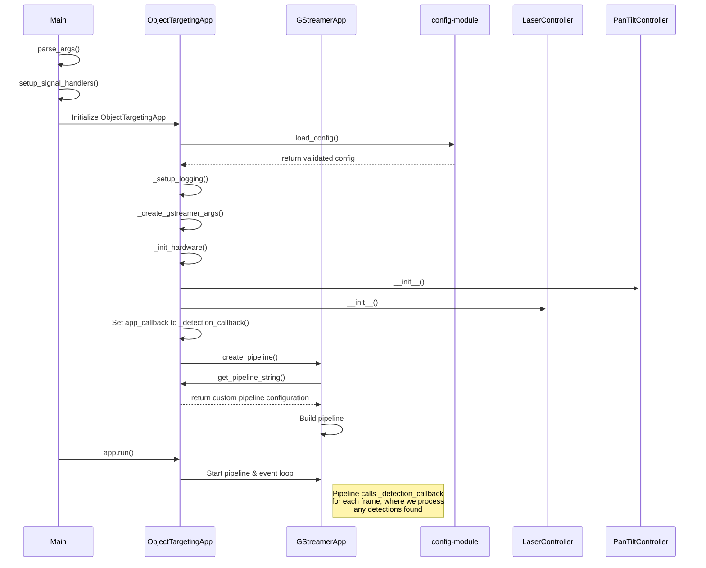

## Startup Sequence Details

### 1. Entry Point (`main.py`)
The application begins in `main.py`, which:
- **Parses Arguments**: Uses argparse to handle command-line arguments
  - Primary argument is `--config` for specifying configuration file path
  - Default config path is 'config.yaml'
- **Sets Up Signal Handlers**: Establishes cleanup handlers for system signals
  - SIGINT (Ctrl+C) and SIGTERM trigger graceful shutdown
  - Ensures hardware cleanup (laser off, servos centered) on termination
- **Initializes Application**: Creates and initializes ObjectTargetingApp instance

### 2. ObjectTargetingApp Initialization
The ObjectTargetingApp performs several initialization steps:

#### Configuration Loading
- Calls `load_config()` from config module to:
  - Load and parse config.yaml
  - Validate all required fields exist
  - Convert relative paths to absolute
  - Verify existence of model files (HEF and post-process)
  
#### Setup and Arguments
- **Logging Setup**: Creates log directory and configures logging
- **GStreamer Arguments**: Creates argument namespace for GStreamer initialization
  - Sets video input to "rpi" for Raspberry Pi camera
  - Configures Hailo-8L specific settings (`arch="hailo8l"`)
  - Specifies ML model:
    - YOLOv8 model compiled to HEF (Hailo Executable Format)
    - Optimized for Hailo-8L accelerator

#### Hardware Initialization
- **Pan/Tilt Controller**: 
  - Initializes with servo configuration
  - Sets up I2C communication (a serial protocol used by Raspberry Pi to communicate with the servo controller board (PCA 9685))
  - Moves to center position
  - Note: I2C allows multiple hardware components to communicate using just two pins: SDA (data) and SCL (clock)

- **Laser Controller**:
  - Sets up GPIO control (General Purpose Input/Output - Raspberry Pi's pins that can be programmed to control hardware)
  - Ensures laser starts in OFF state (GPIO pin set to LOW/0V)
  - Note: GPIO pins can be set to HIGH (3.3V) or LOW (0V) to control simple devices like our laser

### 3. Pipeline Setup
The application leverages GStreamer's framework while implementing custom behavior:

#### Custom Pipeline Configuration
- ObjectTargetingApp overrides `get_pipeline_string()` to define our custom pipeline
- Base GStreamerApp calls our implementation to get pipeline configuration
- Pipeline is built with components for:
  - Video capture (SOURCE_PIPELINE from RPI camera)
  - ML inference (INFERENCE_PIPELINE with YOLOv8s)
  - Person tracking (TRACKER_PIPELINE with tracking frames configuration)
  - Detection processing (USER_CALLBACK_PIPELINE for frame processing)
  - Display output (DISPLAY_PIPELINE with FPS counter)
  
#### Detection Callback Setup
- Sets `_detection_callback` as the frame processor
- This callback is called for every frame and:
  - Processes ML inference results
  - Updates tracking information
  - Controls hardware based on detections

### 4. Application Runtime
Once initialization is complete:
- GStreamer pipeline starts processing frames
- Each frame triggers the detection callback
- Hardware controllers respond to detection results
- Main event loop maintains continuous operation

## Error Handling
The application implements comprehensive error handling:
- Configuration errors raise ConfigurationError with clear messages
- Hardware initialization failures trigger cleanup of already initialized components
- Pipeline creation failures are caught and logged
- All errors are logged with full context for debugging

## Shutdown Process
When shutdown is triggered (via signal or error):
1. Pipeline is stopped and cleaned up
2. Hardware is reset:
   - Laser turned off
   - Servos centered
   - GPIO resources released
3. Logging is finalized
4. Process exits cleanly


# 6. Video Processing Pipeline

## Overview
The video processing pipeline is built on GStreamer, a powerful framework for constructing multimedia processing pipelines. Our system uses a two-layer approach:
1. Base GStreamer framework (provided by Hailo)
2. Our custom pipeline implementation

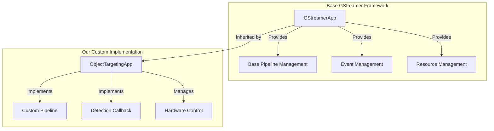

## Our Custom Pipeline Structure

### Pipeline Elements Flow
Our pipeline consists of five main stages, each transforming the data in specific ways:

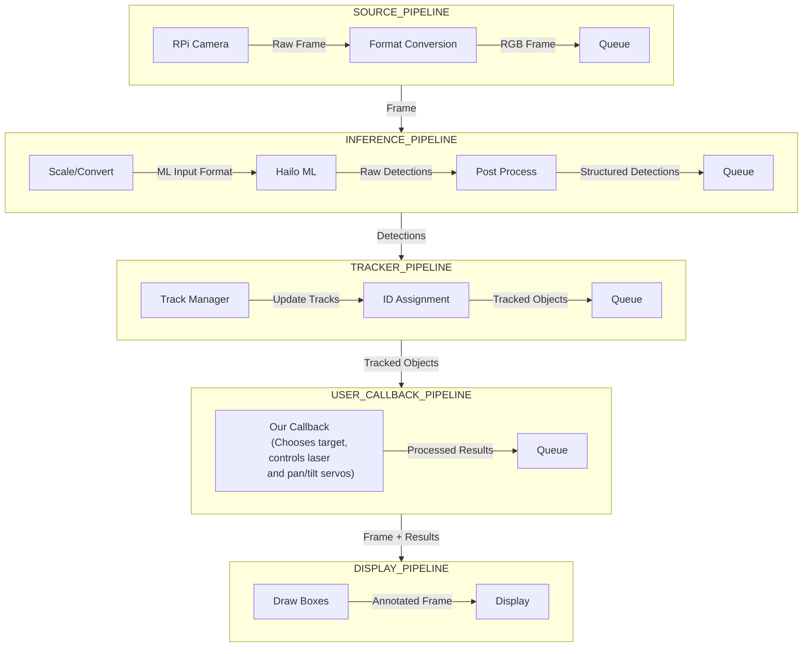

### 1. SOURCE_PIPELINE
- **Purpose**: Captures video from Raspberry Pi camera
- **Key Features**:
  - Configures camera format (e.g., RGB, YUV)
  - Sets resolution (e.g., 640x640, 1920x1080)
  - Manages frame rate
- **Configuration Example**:
```python
source_element = (
    # Initialize camera with specified format and resolution
    f'libcamerasrc name={name} ! '
    f'video/x-raw, format={video_format}, width={width}, height={height}'
)
```

### 2. INFERENCE_PIPELINE
- **Purpose**: Runs YOLOv8s model on Hailo-8L
- **Key Features**:
  - Hardware-accelerated inference
  - Configurable detection thresholds
  - Outputs detection metadata
- **Configuration Example**:
```python
inference_params = (
    # NMS Score Threshold: Only detections with confidence above this threshold are kept
    f"nms-score-threshold={config['detection']['nms_score_threshold']} "
    
    # NMS IOU Threshold: Controls overlap allowed between detection boxes
    f"nms-iou-threshold={config['detection']['nms_iou_threshold']} "
    
    # Output format specification for post-processing
    "output-format-type=HAILO_FORMAT_TYPE_FLOAT32"
)
```

### 3. TRACKER_PIPELINE
- **Purpose**: Maintains object persistence across frames
- **Key Features**:
  - Assigns unique IDs to detected people
  - Tracks objects across frames
  - Manages track lifecycle
- **Configuration Example**:
```python
tracker_pipeline = (
    'hailotracker '
    # These parameters are commonly used values in computer vision tracking tasks
    'keep-tracked-frames=30 '  # Duration to maintain active tracks
    'keep-new-frames=15 '      # Frames needed to confirm new track
    'keep-lost-frames=5'       # Frames before removing lost track
)
```

### 4. USER_CALLBACK_PIPELINE
- **Purpose**: Processes detection results
- **Key Features**:
  - Filters person detections
  - Calculates targeting coordinates
  - Controls hardware based on detections

Note: The detailed implementation of our detection callback will be discussed thoroughly later on.

- **Configuration Example**:
```python
def _detection_callback(self, pad, info, user_data):
    """Process detection results and control hardware."""
    .
    .        (OUR IMPLEMENTATION)
    .
    return Gst.PadProbeReturn.OK
```

### 5. DISPLAY_PIPELINE
- **Purpose**: Provides visual feedback
- **Key Features**:
  - Shows detection boxes
  - Displays tracking IDs
  - Shows FPS counter
- **Configuration Example**:
```python
display_pipeline = (
    # Add detection visualization overlays
    f'hailooverlay name={name}_hailooverlay ! '
    # Configure display settings and performance metrics
    f'fpsdisplaysink name={name} sync={sync} text-overlay={show_fps}'
)
```

## Custom Pipeline Implementation
Our `ObjectTargetingApp` extends the base GStreamer framework through:

1. **Pipeline Configuration**
```python
def get_pipeline_string(self) -> str:
    """Creates our custom GStreamer pipeline string."""
    pipeline = (
        f"{SOURCE_PIPELINE('rpi')} "
        f"{INFERENCE_PIPELINE(self.config['paths']['model']['hef_path'])} "
        f"{TRACKER_PIPELINE()} "
        f"{USER_CALLBACK_PIPELINE()} "
        f"{DISPLAY_PIPELINE()}"
    )
    return pipeline
```

# 7. Frame Processing and Detection

## Overview
The detection callback is the core processing unit of our application, called for each frame in our video pipeline. It bridges between ML detections and hardware control, implementing the logic that turns video frames into targeting actions.

## Callback Processing Flow
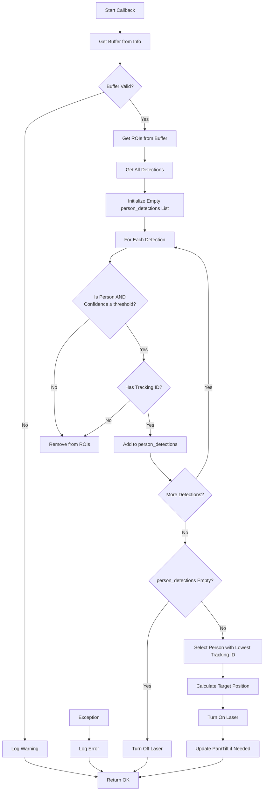

## Implementation Details

### Detection Processing
```python
def _detection_callback(self, pad, info, user_data):
    try:    
        # 1. Get buffer (frame) from probe info
        buffer = info.get_buffer()
        if not buffer: 
            logging.warning("No buffer received")
            return Gst.PadProbeReturn.OK
        
        # 2. Get detections from buffer
        rois = hailo.get_roi_from_buffer(buffer)
        all_detections = rois.get_objects_typed(hailo.HAILO_DETECTION)

        # 3. Filter for person detections
        person_detections = []
        for det in all_detections:
            if det.get_label() == "person" and \
               det.get_confidence() >= self.config['detection']['nms_score_threshold']:
                tracking_ids = det.get_objects_typed(hailo.HAILO_UNIQUE_ID)
                if tracking_ids:
                    person_detections.append(det)
            else:
                rois.remove_object(det)

        # 4. Handle no detections case
        if not person_detections:
            self.laser.turn_off()
            return Gst.PadProbeReturn.OK

        # 5. Select and target person
        selected_person = min(person_detections, 
                            key=lambda x: x.get_objects_typed(hailo.HAILO_UNIQUE_ID)[0].get_id())
        
        # 6. Update hardware
        center_x, center_y = self.target_position(selected_person)
        self.laser.turn_on()
        self.pan_tilt.update_if_needed(center_x, center_y)

        return Gst.PadProbeReturn.OK

    except Exception as e:
        logging.error(f"Error in detection callback: {e}")
        return Gst.PadProbeReturn.OK
```

## Key Components

### 1. Detection Retrieval
- Gets the current frame buffer from GStreamer pipeline
- Extracts Regions of Interest (ROIs) containing detections
- Retrieves all objects detected by the ML model

### 2. Person Filtering
The callback implements specific filtering criteria:
- Object class must be "person"
- Detection confidence must exceed threshold
- Object must have a valid tracking ID

### 3. Target Selection Strategy
When multiple people are detected, the system:
- Selects the person with the lowest tracking ID
- This effectively targets the person who was first detected
- Maintains consistent targeting rather than switching between people

### 4. Position Calculation
For the selected target:
- Calculates center point of bounding box
- Converts to normalized coordinates (0-1 range)
- These coordinates are used for servo control

## Error Handling
The callback implements comprehensive error handling:
- Validates buffer existence
- Ensures ROIs are properly extracted
- Gracefully handles cases with no detections
- Logs errors for debugging
- Never crashes the pipeline (always returns OK)

# 8. Targeting System and Motion Control

## Overview
The targeting system converts detected person coordinates from the video frame into precise servo movements that aim our laser at the target. This involves a series of carefully designed coordinate transformations that account for both geometric effects and real-world hardware considerations.

## Coordinate Processing Pipeline
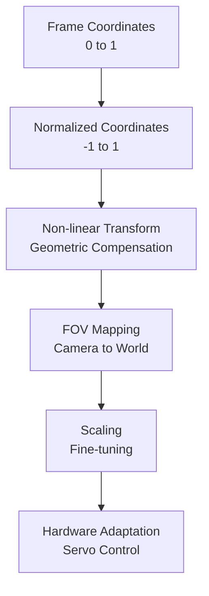

## Transformation Chain

### Coordinate Normalization
Before any processing begins, we convert the frame coordinates (which range from 0 to 1) into a center-relative coordinate system (-1 to 1):
```python
# Convert from frame coordinates to center-relative
x_deviation = (center_x - 0.5) * 2  # Range: -1 (left) to +1 (right)
y_deviation = (center_y - 0.5) * 2  # Range: -1 (bottom) to +1 (top)
```

### Non-linear Transform

#### The Challenge
When tracking targets across a camera's field of view, we face an inherent targeting precision problem that stems from the geometric relationship between angular movement and physical distance:

1. Near the center of the frame (small deviations):
   - Due to basic trigonometry, a 1° servo movement translates to a larger physical distance when pointing straight ahead
   - For example: At 3 meters distance, a 1° movement shifts our aim by ~5.2 cm at the center
   - This makes precise targeting difficult because even small angular adjustments create large movements

2. At the edges of the frame (large deviations):
   - The same 1° movement translates to a smaller physical distance due to the angular relationship
   - At the same 3m distance but at 45° from center, a 1° movement only shifts our aim by ~3.7 cm
   - This creates sluggish response when tracking targets at the edges

#### The Solution
To compensate for this geometric effect, we apply a non-linear power transformation to our normalized coordinates:
```python
def _apply_nonlinear_transform(self, value: float, power: float) -> float:
    """
    Apply non-linear power transformation while preserving sign.
    Args:
        value: Input value in range [-1, 1]
        power: Power factor for non-linear scaling (>1 reduces small movements)
    """
    return math.copysign(math.pow(abs(value), power), value)
```

Through empirical testing combined with geometric understanding, we found that:
- A power of 1.5 for pan (horizontal) movement provides optimal balance
- A slightly lower power of 1.3 for tilt (vertical) movement works better since vertical movements tend to be smaller

### Field of View Mapping

#### Overview
After the non-linear transform, we convert our normalized values into actual servo angles using the camera's field of view specifications.

#### The Concept
The system uses the Camera Module 3's field of view specifications:
- Horizontal FOV: 66.0°
- Vertical FOV: 41.0°

This means that:
- A target at the right edge of the frame is 33° right of center
- A target at the left edge of the frame is 33° left of center
- A target at the top edge is 20.5° above center
- A target at the bottom edge is 20.5° below center

#### Implementation
```python
# Calculate final angles with FOV mapping
pan_angle = -x_deviation * self.fov['horizontal']  
tilt_angle = y_deviation * self.fov['vertical']
```

The negative sign for pan_angle ensures correct directional movement:
- Negative deviation (target on left) → Positive servo angle
- Positive deviation (target on right) → Negative servo angle

### Scaling Factor

#### Overview
The final mathematical transformation applies a scaling factor to our FOV-mapped angles, providing fine-tuning capabilities for real-world operation.

#### Implementation
```python
# Apply scaling to final angles
pan_angle = -x_deviation * self.fov['horizontal'] * pan_scaling  
tilt_angle = y_deviation * self.fov['vertical'] * tilt_scaling
```

#### Purpose and Benefits
1. Mechanical Compensation
   - Real-world servo installations may not perfectly align with the camera's optical axis
   - Small mounting imperfections can affect targeting accuracy
   - The scaling factor (0.9) helps compensate for these mechanical variances
   - Acts as a calibration tool to match servo movement with camera view

2. Fine-Tuning Capability
   - The scaling factor can be adjusted in configuration to:
     - Match different servo models
     - Compensate for different mounting configurations
     - Adjust for varying target distances
   - Provides a simple way to tune system behavior without modifying code

Through empirical testing, we found that a scaling factor of 0.9 for both pan and tilt movements provides optimal performance in our setup.

#### Configuration
The scaling factors are configurable in our YAML configuration:
```yaml
servo:
  pan:
    scaling_factor: 0.9
  tilt:
    scaling_factor: 0.9
```

### Hardware Adaptation
The final step converts our calculated angles into actual servo commands:
```python
def move(self, pan_angle: float, tilt_angle: float):
    # Constrain angles to safe physical limits
    pan_angle = self._constrain_angle(pan_angle, self.pan_limits)
    tilt_angle = self._constrain_angle(tilt_angle, self.tilt_limits)
    
    # Add angles to calibrated centers
    servo_pan_angle = self.pan_center + pan_angle
    servo_tilt_angle = self.tilt_center + tilt_angle
    
    # Move servos
    self.pan_servo.angle = servo_pan_angle
    self.tilt_servo.angle = servo_tilt_angle
```

This final adaptation:
1. Constrains angles to prevent cable damage
2. Converts relative angles to absolute servo positions
3. Sends the final commands to the hardware

## License  
© 2024–2025 Yoav Schwammenthal and Nave Blander. All rights reserved.  
This project and its source code may not be copied, modified, or distributed without explicit permission.
